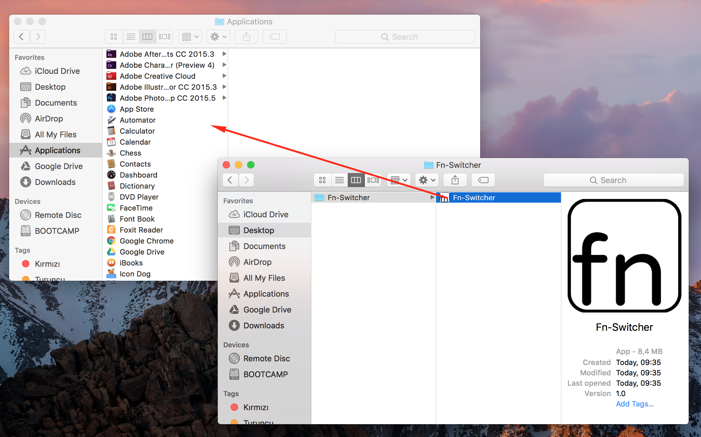
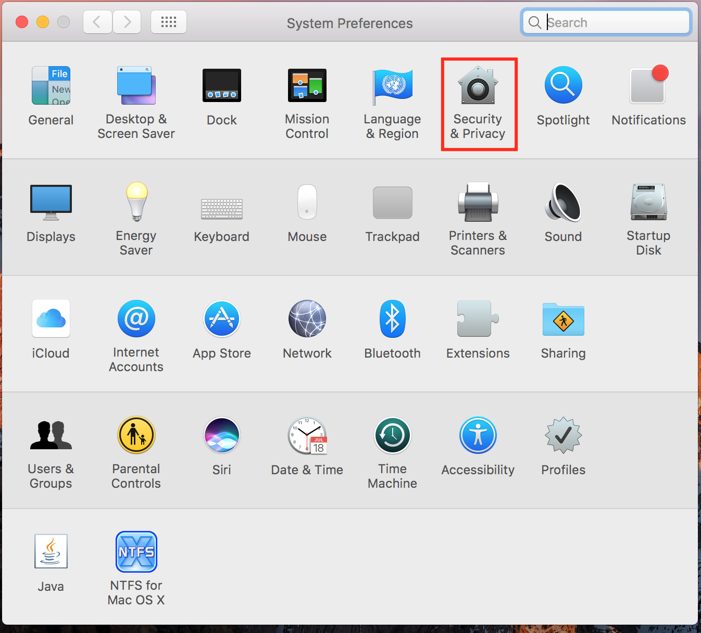
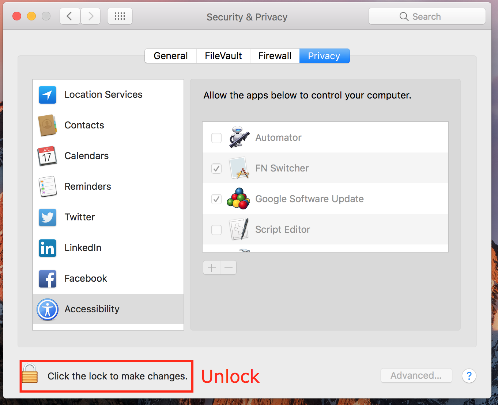
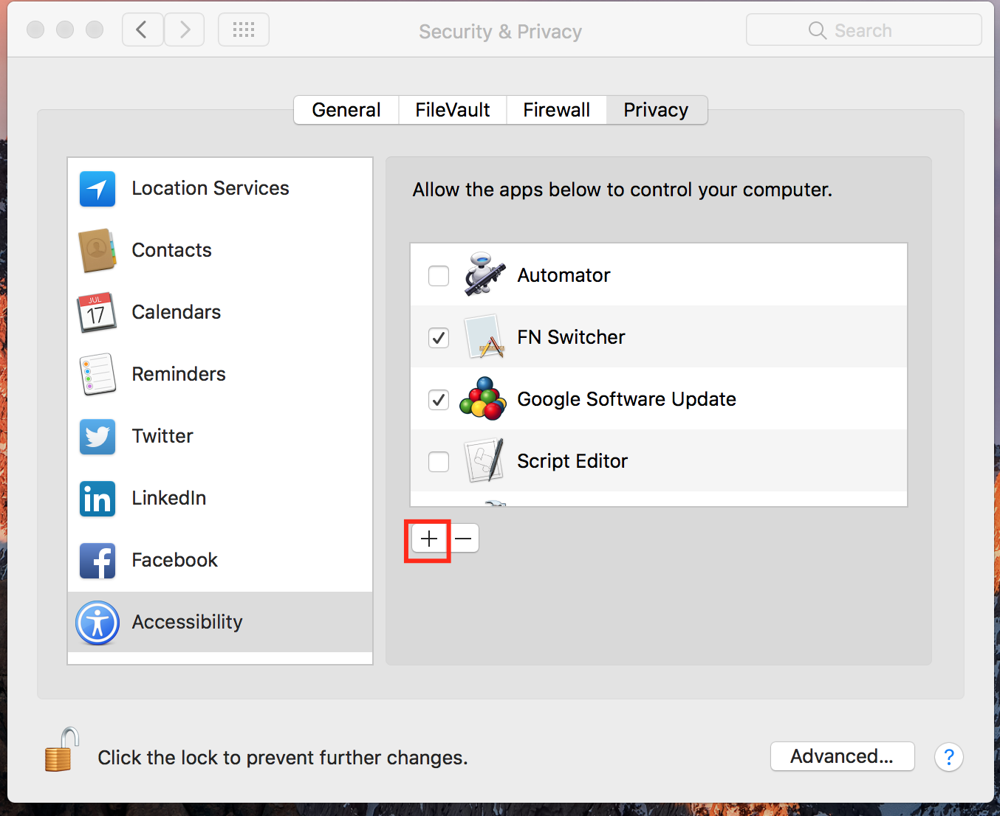
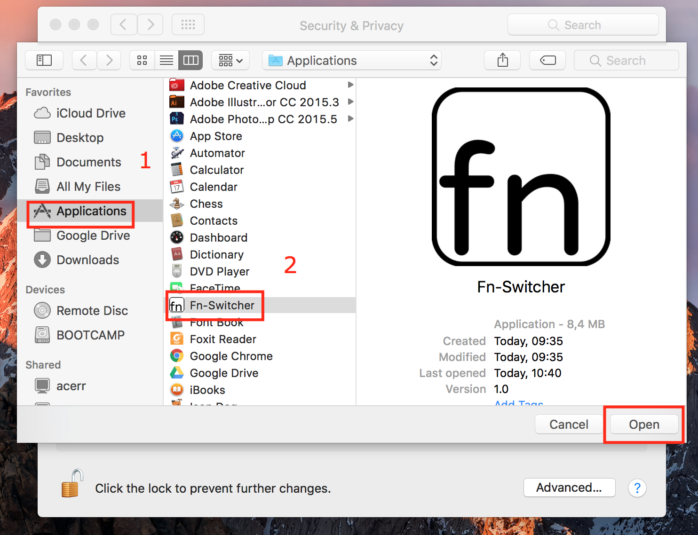

# Fn-Switcher
This OSX Menubar app for change your function keys to special keys.

  

On a typical Mac the function keys have a special meaning. They are used to control the volume, the screen's brightness or iTunes. But some applications, IDEs use the normal function keys. Fn-Switcher allows you to easily use your function keys in the applications that you need them.

Watching series,movies or YouTube videos and want to use special keys ? Just click and Fn-Switcher enable your special keys.

##Features

* Add shortcut for switch.
* Solve privacy problem.
* Edit scpt path.

##Install

1. Moved to Application

  

2. System Prefences > Security & Privacy

  

3. Unlock

  

4. Click "+" 

  

5. Select "Fn-Switcher" and add

  

